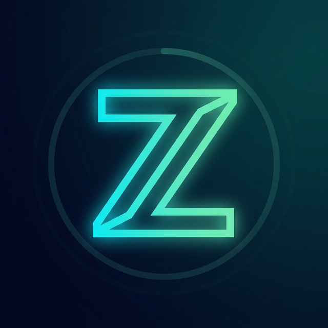
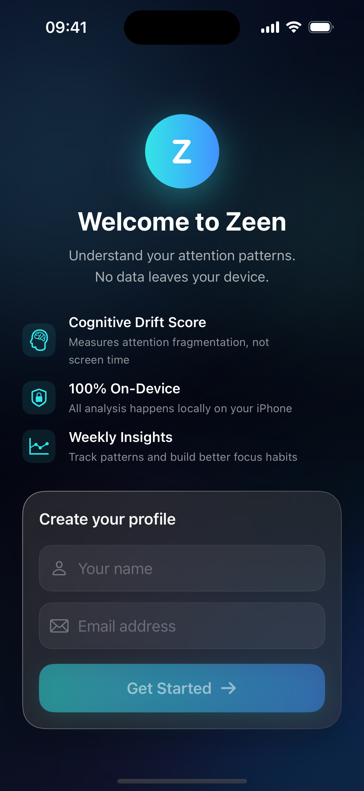
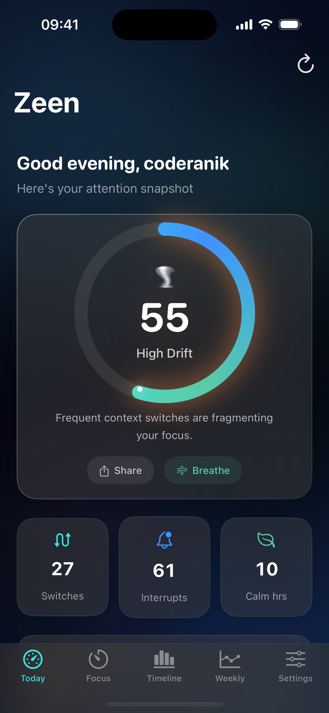
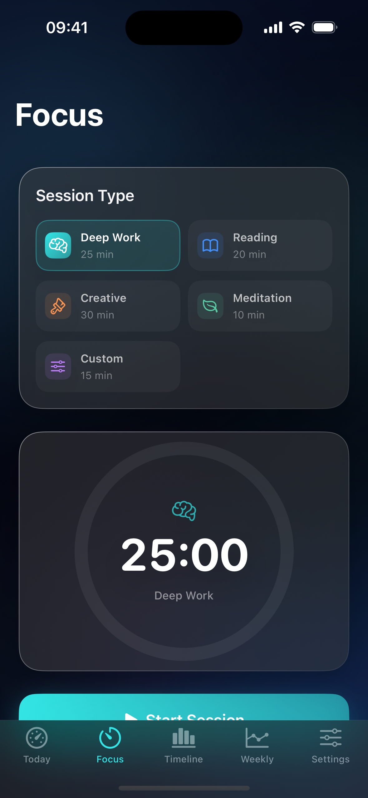
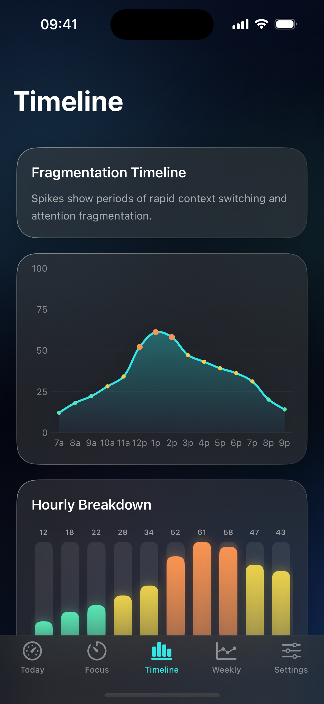
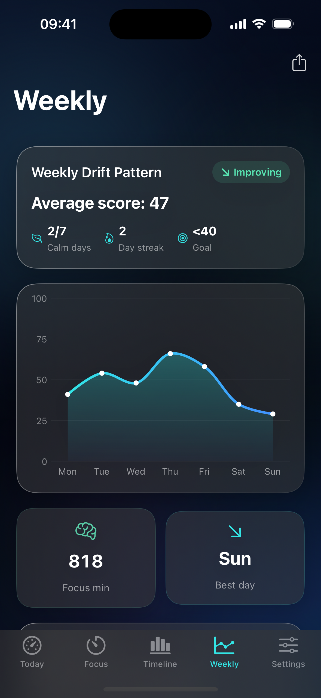
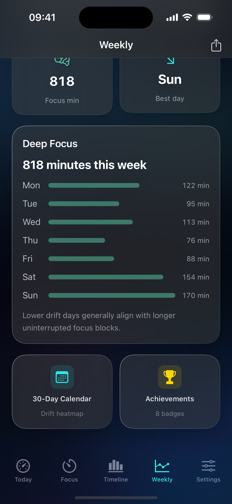
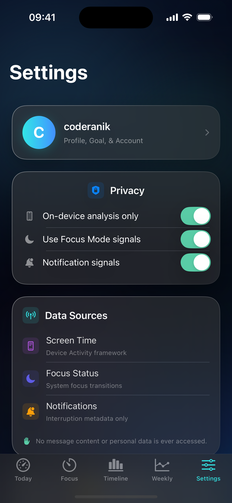
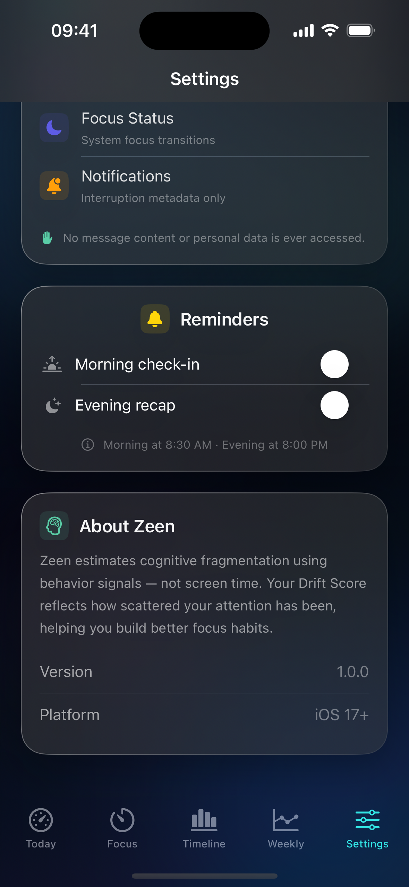
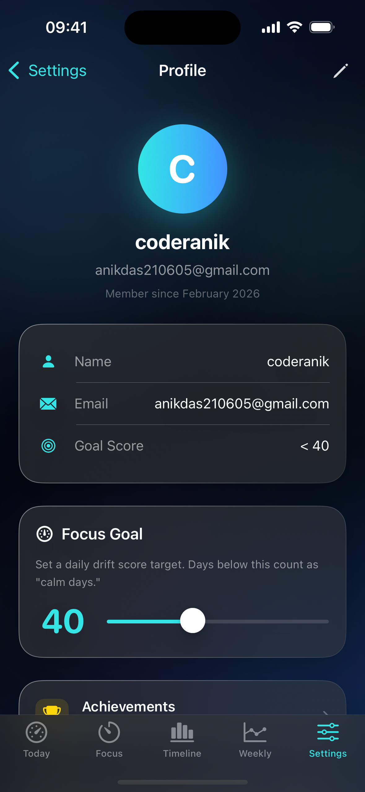

# 🧠 Zeen — Cognitive Fragmentation Tracker

> **Zeen** estimates how fragmented your attention is throughout the day. Instead of tracking raw screen time, it measures *cognitive drift* — how scattered your focus patterns are — and gives you a daily **Drift Score** from 0 (calm) to 100 (overloaded).

<p align="center">
  
</p>

---

## ✨ Features

### 📊 Drift Score Dashboard
- Real-time score ring with angular gradient and counting animation
- Dynamic greeting based on time of day
- Factor breakdown showing what drove today's score
- Peak drift window identification
- Contextual insights with tone-coded severity

### 📡 Live Behavioral Tracking
- **Real-time app switch detection** via `ScenePhase` lifecycle monitoring
- **Short session tracking** — sessions under 2 minutes count as fragmented attention
- **Notification interruption counting** via `UNUserNotificationCenter` delivered notifications
- **Focus break detection** — leaving the app during a focus session registers as a break
- All signals **persisted hourly and daily** to `UserDefaults` with automatic day rollover
- No mock data — every metric is earned through real user behavior

### ⏱ Focus Session Timer
- 4 session types: Deep Work (25m), Reading (20m), Creative (30m), Meditation (10m)
- Animated timer ring with pulsing glow during active sessions
- Full state machine: Start → Pause → Resume → Stop
- Today's stats cards and session history
- **Persisted** lifetime session count via `@AppStorage`

### 🫁 Guided Breathing Exercise
- 4-7-8 breathing technique (Breathe In 4s, Hold 7s, Breathe Out 8s) × 4 cycles
- Animated radial gradient circle that expands/contracts per phase
- Phase-specific haptic feedback (`UIImpactFeedbackGenerator`)
- Contextually triggered when drift score ≥ 40

### 📈 Timeline & Weekly Insights
- **Timeline**: SwiftUI Charts area+line chart with Catmull-Rom interpolation
- **Weekly**: 7-day trend badge (improving/stable/worsening), deep focus progress bars
- **Export**: Share formatted weekly report via `UIActivityViewController`

### 📅 30-Day Heatmap Calendar
- GitHub-style contribution graph of daily drift levels
- Monthly stats: calm days, average score, best streak, hard days
- Animated distribution bars per drift level

### 🏆 Achievements System (8 Badges)
| Badge | Unlock |
|-------|--------|
| 🍃 Inner Peace | Score below 30 |
| 🔥 Momentum | 3-day calm streak |
| ⚡️ Unstoppable | 7-day calm streak |
| ⏱ Deep Diver | Complete 1 focus session |
| 👑 Focus Master | Complete 10 focus sessions |
| 💨 Zen Master | Complete a breathing exercise |
| 🌅 Early Bird | Check score before 8 AM |
| ⭐️ Perfect Day | All hours below 30 |

All achievement progress **persists** across app restarts via `@AppStorage`.

### 📤 Score Share Card
- `ImageRenderer` generates @3x `UIImage` of your drift report
- Branded card with score ring, factors, user name, and date
- Native share sheet via `UIActivityViewController`

### 🔔 Smart Notifications
- Morning check-in (8:30 AM) and evening recap (8:00 PM)
- Async permission handling with `UNUserNotificationCenter`
- Configurable toggles in Settings

### ⚙️ Settings & Profile
- iOS Settings-style grouped layout
- Tappable profile card → Profile Detail view
- Edit mode with animated toggle, goal score slider
- Privacy section demonstrating on-device analysis commitment

### 🚀 Onboarding
- Animated splash screen with sequenced ring/logo/title animations
- Auth flow with feature highlights and gradient CTA button

---

## 🏗 Architecture

```
Zeen/
├── ZeenApp.swift                  # App entry, environment injection, ScenePhase tracking
├── Models/
│   ├── DriftModels.swift          # DriftInput, DriftScore, DriftLevel, DriftFactor,
│   │                                DailySummary, WeeklySummary, DriftInsight, TrendDirection
│   ├── UserModels.swift           # UserProfile (Codable)
│   ├── FocusSessionModels.swift   # FocusSessionType, FocusSessionRecord, FocusSessionState
│   └── AchievementModels.swift    # Achievement catalog, DailyRecord
├── Services/
│   ├── DriftScoringService.swift  # Weighted factor scoring, insight generation, trend detection
│   ├── ActivityTracker.swift      # Real-time behavioral signal tracking (app switches,
│   │                                short sessions, notifications, focus breaks)
│   ├── LiveDataProvider.swift     # ZeenDataProviding backed by real ActivityTracker data
│   ├── MockDataProvider.swift     # Protocol + mock implementation for testing
│   └── NotificationService.swift  # UNUserNotificationCenter wrapper
├── ViewModels/
│   ├── DashboardViewModel.swift   # Daily/weekly state, insights, trends
│   ├── SessionViewModel.swift     # User profile, auth, UserDefaults persistence
│   └── FocusSessionViewModel.swift # Timer state machine, @AppStorage counters, focus break tracking
├── DesignSystem/
│   └── ZeenTheme.swift            # Accent palette, gradients, animations, GlassBackground
├── Views/
│   ├── AppRootView.swift          # Splash → Auth → Main flow
│   ├── RootTabView.swift          # 5-tab navigation
│   ├── Components/
│   │   ├── GlassCard.swift        # Glassmorphism container with staggered animation
│   │   ├── ScoreRing.swift        # Angular gradient ring with VoiceOver
│   │   ├── TimelineBar.swift      # Animated vertical bar
│   │   ├── StatCard.swift         # Metric card with VoiceOver
│   │   ├── InsightBanner.swift    # Tone-colored insight display
│   │   ├── FactorRow.swift        # Animated progress bar with VoiceOver
│   │   ├── ZeenTextField.swift    # Themed text input
│   │   ├── ScoreShareCard.swift   # ImageRenderer share card
│   │   └── ActivityViewWrapper.swift # UIActivityViewController bridge
│   └── Screens/
│       ├── SplashView.swift       # Animated launch sequence
│       ├── AuthView.swift         # Onboarding + registration
│       ├── TodayView.swift        # Dashboard with share + breathing
│       ├── FocusSessionView.swift # Timer with type grid
│       ├── TimelineScreen.swift   # Charts-based hourly view
│       ├── WeeklyInsightsView.swift # Trend analysis + export
│       ├── DriftCalendarView.swift # 30-day heatmap
│       ├── AchievementsView.swift # Badge gallery
│       ├── SettingsView.swift     # iOS-style settings
│       ├── ProfileDetailView.swift # Profile editor
│       └── BreathingView.swift    # 4-7-8 breathing exercise
└── ZeenTests/
    └── DriftScoringServiceTests.swift # 13 unit tests
```

---

## 🔬 How Live Tracking Works

Zeen tracks **real behavioral signals** without requiring Screen Time or DeviceActivity entitlements:

| Signal | How It's Measured | Storage |
|--------|-------------------|---------|
| **App Switches** | `ScenePhase` transitions (background → active) | Per-hour + daily counter |
| **Short Sessions** | Sessions under 2 minutes before backgrounding | Per-hour + daily counter |
| **Notification Interruptions** | `UNUserNotificationCenter.getDeliveredNotifications()` delta on foreground | Per-hour + daily counter |
| **Focus Breaks** | Leaving the app while a focus timer is running | Per-hour + daily counter |

Each signal is recorded per-hour for the **Timeline** chart and aggregated daily for the **Weekly** view and **Calendar** heatmap. The `DriftScoringService` applies weighted normalization (app switches 35%, short sessions 25%, notifications 25%, focus breaks 15%) to produce the final Drift Score.

---

## 🛠 Tech Stack & APIs Used

| Category | Tech |
|----------|------|
| UI | SwiftUI, Charts framework |
| Architecture | MVVM, `@StateObject`, `@EnvironmentObject` |
| Behavioral Tracking | `ScenePhase`, `UNUserNotificationCenter` |
| Persistence | `UserDefaults` (Codable), `@AppStorage` |
| Sharing | `ImageRenderer` (iOS 16+), `UIActivityViewController` |
| Notifications | `UNUserNotificationCenter`, `UNCalendarNotificationTrigger` |
| Haptics | `UIImpactFeedbackGenerator`, `UINotificationFeedbackGenerator` |
| Animation | `symbolEffect`, `contentTransition`, Spring animations |
| Accessibility | VoiceOver labels, `accessibilityElement`, `accessibilityValue` |
| Testing | XCTest, `@testable import` |
| CI | GitHub Actions, `xcodebuild`, macOS 15 runner |

---

## 🎯 Design Philosophy

1. **Privacy-First** — All analysis happens on-device. No personal data leaves the phone.
2. **Attention Quality > Screen Time** — We measure *how* you use your phone, not *how long*.
3. **Real Data, Not Mock Data** — Every signal is earned through actual user behavior. The app starts at score 0 and builds up organically.
4. **Glassmorphism + Dark Mode** — Premium visual identity with `.ultraThinMaterial` cards, animated backgrounds, and curated color palette.
5. **Actionable** — Don't just show data. Offer focus sessions, breathing exercises, and shareable reports.
6. **Accessible** — VoiceOver labels on all key components.

---

## 🚀 Running

1. Open `Zeen.xcodeproj` in Xcode 16+
2. Select an iPhone simulator (iOS 17+)
3. `⌘R` to build and run
4. Run tests with `⌘U`

> **Note**: Zeen uses live behavioral tracking via `ScenePhase` and `UNUserNotificationCenter`. The drift score starts at 0 and builds up as you use your phone — switch between apps, receive notifications, and take focus breaks to see the score respond in real time. A `MockDataProvider` is retained for unit testing.

---
## 📸 Screenshots

| Onboarding | Home/Today | Focus Timer |
| :---: | :---: | :---: |
|  |  |  |

| Timeline | Weekly Summary 1.0 | Weekly Summary 2.0 |
| :---: | :---: | :---: |
|  |  |  |

| Settings Overview 1.0 | Settings Overview 2.0 | Profile |
| :---: | :---: | :---: |
|  |  |  |

**Built for the Swift Student Challenge 2026. Made with ❤️ by [Anik](https://github.com/coderanik).**
